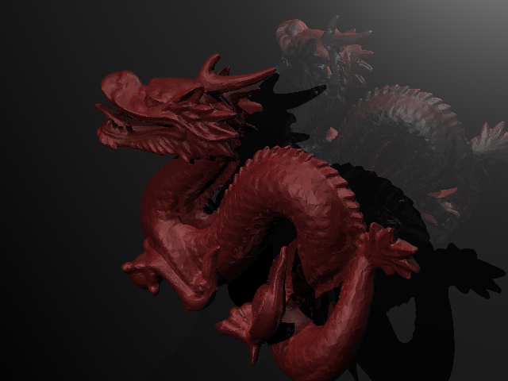

# Raytracer

Auteurs : Nicolai Drobyshevski et Romain Yermolov

## Présentation

Ce projet implémente un ray tracer en Java. Un ray tracer est un algorithme de rendu permettant de générer des images réalistes en simulant la trajectoire des rayons lumineux lors de leur interaction avec des objets 3D.




## Fonctionnalités

- Rendu d’images réalistes à partir de fichiers de scènes personnalisées.
- Prise en charge de différentes primitives géométriques.
- Support de matériaux et d’effets de lumière de base.
- Sauvegarde des images produites au format PNG.

## Prérequis

- **Java 11** ou une version ultérieure.
- L'outil **Maven**.
- Un environnement de développement (IDE, JDK installé).

## Compilation et exécution

1. Clonez le dépôt :
   ```bash
   git clone https://github.com/n-drobyshevski/raytracer.git
   ```
2. Compilez le projet (depuis le dossier raytracer):
   ```bash
   mvn clean package
   ```
3. Exécutez la génération d’une image :
   ```bash
   java -jar target/raytracer-1.0-SNAPSHOT-shaded.jar test0.scene
   ```

## Arborescence

- `raytracer/` - code source principal.
- `*.png` - Exemples d’images générées.
- `*.scene` - Exemples de fichiers de description de scènes.
